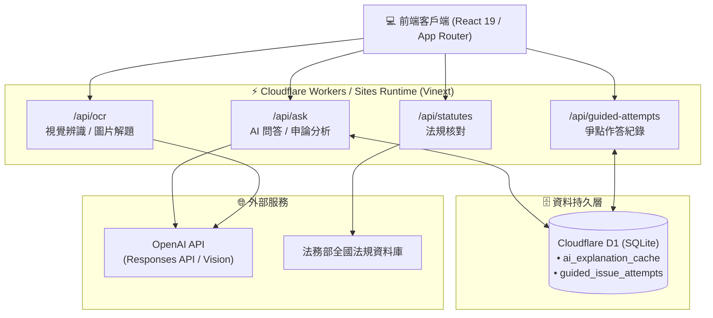

# iBrainPediaX (智匯學習平台)

> **專為法律與中級會計考生打造的智慧知識庫與 AI 深度陪練平台**

[](https://nextjs.org/)
[](https://react.dev/)
[](https://www.typescriptlang.org/)
[](https://github.com/cloudflare/vinext)
[](https://developers.cloudflare.com/d1/)
[](https://orm.drizzle.team/)

---

## 📖 專案簡介

**iBrainPediaX** 是一個結合「法律國考」與「中級會計學」的專業智慧學習與考題輔導系統。平台整合結構化教材、歷屆試題庫、多模態 OCR 解題、法務部法規資料庫即時核對，並利用 OpenAI 結構化模型提供一試選擇題診斷、二試申論題層次比較與爭點拆解訓練。

專案以 **Next.js 16 + React 19** 建置，並透過 **Vinext** 部署於 **Cloudflare Workers / OpenAI Sites** 邊緣環境，搭配 **Cloudflare D1** 實現高可用、低延遲的解說快取與作答紀錄持久化。

---

## ✨ 核心功能特色

### 1. 🔍 教材證據搜尋與 AI 智能問答
- 支援民法、刑法、公法、訴訟法與中級會計學跨學科精準檢索。
- 回答嚴格錨定平台教材證據（包含書籍標題、版次、章節與頁碼），杜絕 AI 幻覺。
- 內建嚴謹的法律概念分類規則（如純正與不純正不作為犯的審查階層與要件檢驗）。

### 2. 📝 一試選擇題測驗與智慧診斷
- 提供歷屆試題（如 114 年國考題庫）即時模擬作答。
- 支援即時答案核對、個人化錯題本、精選收藏夾。
- 自動統計章節弱點熱區，產出「核心弱點 / 可能弱點 / 待觀察」學習狀態分級。

### 3. 🎯 爭點拆解式引導訓練 (Guided Issue-Spotting)
- 將複雜案例細拆為法律要件與邏輯思維步驟。
- 引導考生按步驟作答並即時提供正誤解析。
- 作答紀錄自動存入 Cloudflare D1，支援學習軌跡跨裝置追蹤。

### 4. ✍️ 二試申論題深度陪練與擬答比較
- 提供名師擬答、關鍵爭點與評分規準。
- 考生輸入個人作答後，AI 自動從「論理結構、法條適用、學說判例、結論周延度」多維度進行評估。
- 標註學生漏答爭點與邏輯盲區，輔以建議修改方案。

### 5. 📷 拍照上傳與 OCR 智慧解題
- 支援考題照片上傳（JPEG, PNG, WebP，上限 8MB）。
- 多模態視覺模型自動辨識題目文字、選項與題型，進行排版與深度解答。
- 具備跨科目防呆校驗與模糊圖片重試機制。

### 6. ⚖️ 全國法規資料庫即時核對
- 串接法務部法規資料庫，即時校驗法條最新修正內容。
- 透過白名單機制（Pcode Allowlist）確保法規調用安全。

### 7. ⚡ AI 解說分散式快取
- 透過 Cloudflare D1 之 `ai_explanation_cache` 機制，依題目與內容版本共用高品質解析。
- 大幅降低 API 調用成本，並達到毫秒級即時解析響應。

---

## 🏗️ 系統架構



---

## 📁 專案目錄結構

```text
.
├── app/
│   ├── api/
│   │   ├── ask/                 # AI 問答、申論審查、法律審查階層與快取
│   │   ├── guided-attempts/     # 爭點引導訓練作答持久化 API
│   │   ├── ocr/                 # 多模態圖片試題辨識與解題
│   │   └── statutes/            # 全國法規資料庫驗證
│   ├── data/
│   │   └── first-exam-114.json  # 114 年歷屆試題與題庫資料
│   ├── layout.tsx               # 全域 Layout 與中文字體配置
│   ├── globals.css              # 系統整體樣式與排版
│   └── page.tsx                 # 核心學習流程單頁互動應用
├── build/
│   └── sites-vite-plugin.ts     # OpenAI Sites 構建與 manifest 打包外掛
├── db/
│   ├── index.ts                 # Cloudflare D1 / Drizzle ORM 連線客戶端
│   └── schema.ts                # Drizzle 資料庫綱要定義
├── docs/
│   └── engineering-roadmap.md   # 架構重構與工程化路線圖
├── drizzle/                     # D1 SQL 遷移腳本
├── public/                      # 靜態資源檔案
├── scripts/                     # CI 安裝、構建與環境驗證腳本
├── tests/
│   └── rendered-html.test.mjs   # 產物驗證與 SSR Smoke Test
├── .openai/
│   └── hosting.json             # OpenAI Sites D1/R2 綁定宣告
├── drizzle.config.ts            # Drizzle Kit 設定
├── package.json                 # 專案套件設定
├── tsconfig.json                # TypeScript 編譯設定
└── vite.config.ts               # Vinext / Vite / Cloudflare 邊緣開發設定
```

---

## 🚀 快速上手

### 環境需求
- **Node.js**: `>=22.13.0`
- **npm**: `>=10.0.0`
- **Linux / macOS**: 需具備 `flock`, `curl` 與 GNU `timeout`

### 安裝與啟動

1. **安裝依賴套件**
   ```bash
   npm run install:ci
   ```

2. **啟動本機開發伺服器**
   ```bash
   npm run dev
   ```
   開發伺服器將於 `http://localhost:3000` 或 `http://localhost:5173` 啟動，並自動模擬 Cloudflare D1 與 Workers 環境。

3. **專案打包與測試**
   ```bash
   # 建置部署產物
   npm run build

   # 執行自動化 Smoke Test
   npm test

   # 執行程式碼品質檢查
   npm run lint
   ```

---

## ⚙️ 環境變數設定

請在部署平台或本機環境變數中進行配置（**切勿將 `.env` 或 API 金鑰推送到 Git 倉庫**）：

| 變數名稱 | 類型 | 說明 | 預設值 |
|---|---|---|---|
| `OPENAI_API_KEY` | 必要 | OpenAI API 金鑰 (僅伺服器端調用) | - |
| `OPENAI_MODEL` | 選用 | 一般問答與推理模型 | `gpt-5-mini` |
| `OPENAI_REVIEW_MODEL` | 選用 | 申論題對比與深度審查模型 | 沿用 `OPENAI_MODEL` |
| `OPENAI_IMAGE_MODEL` | 選用 | 圖片 OCR 與視覺解題模型 | - |
| `OPENAI_OCR_MODEL` | 選用 | 圖片 OCR 備用模型 | - |
| `DB` | 系統綁定 | Cloudflare D1 Binding 名稱 (於 `.openai/hosting.json` 宣告) | `DB` |

---

## 🗄️ 資料庫綱要 (Drizzle ORM)

資料庫採用 Cloudflare D1 (Serverless SQLite)，目前定義了兩張核心資料表：

```typescript
// 1. AI 解析快取表 (共享題目版本解析)
ai_explanation_cache (
  id               INTEGER PRIMARY KEY AUTOINCREMENT,
  cache_key        TEXT NOT NULL UNIQUE,
  question_id      TEXT NOT NULL,
  content_version  TEXT NOT NULL,
  answer           TEXT NOT NULL,
  model            TEXT NOT NULL,
  generated_at     TEXT DEFAULT CURRENT_TIMESTAMP
)

// 2. 爭點拆解練習作答紀錄表
guided_issue_attempts (
  id               INTEGER PRIMARY KEY AUTOINCREMENT,
  learner_key      TEXT NOT NULL,
  attempt_id       TEXT NOT NULL,
  question_key     TEXT NOT NULL,
  domain           TEXT NOT NULL,
  topic            TEXT NOT NULL,
  step_id          TEXT NOT NULL,
  step_label       TEXT NOT NULL,
  selected_option  INTEGER NOT NULL,
  correct_option   INTEGER NOT NULL,
  correct          BOOLEAN NOT NULL,
  answered_at      TEXT NOT NULL,
  UNIQUE(learner_key, attempt_id, question_key, step_id)
)
```

如需修改綱要，請編輯 [`db/schema.ts`](db/schema.ts) 並執行：
```bash
npm run db:generate
```

---

## 🛡️ 可靠性與安全防護機制

- **法律分類審查防護**：法律 AI 回答內建分流檢驗，嚴格防範上位概念（如不作為犯）要件與下位概念（如不純正不作為犯）混淆。
- **輸入邊界白名單**：法規即時查詢限定合法 `pcode`，避免任意 URL Request 穿透。
- **OCR 容錯與限制**：限制上傳格式（JPEG/PNG/WebP）及 8MB 容量，針對低對比度與模糊試題照片具備自適應錯誤提示。
- **快取容錯隔離**：D1 解說快取寫入失敗時不中斷前端學生測驗流程，保證最優用戶體驗。

---

## 🗺️ 工程化路線圖

詳細的前端單體模組化（Feature 拆分）、單元測試、可信身分驗證與 Rate Limit 規劃，請參閱：
👉 **[iBrainPediaX 工程化路線圖 (docs/engineering-roadmap.md)](docs/engineering-roadmap.md)**

---

## 📄 授權說明

本專案版權所有 © 2026 iBrainPediaX 團隊。
